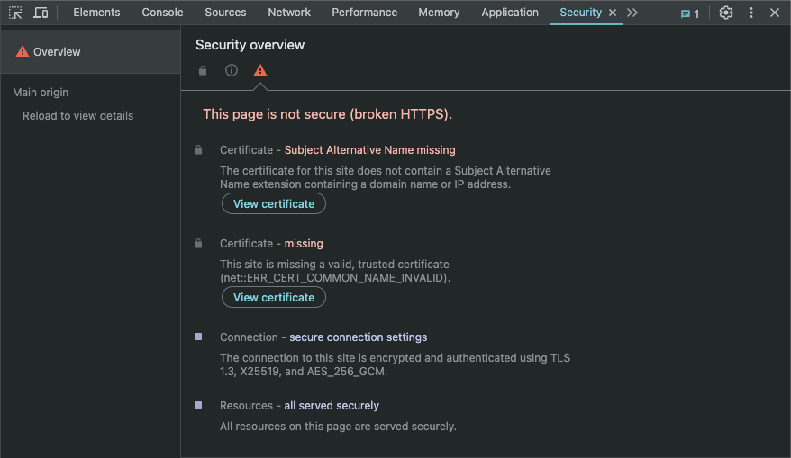

# Expressjs + AWS Lambda + Clerk + Swagger + Localhost HTTPS

This is a backend project that solves a simple problem. I had a couple needs that aren't fulfilled in other templates/libraries:

1. Serverless Lambda run by Express.js - This makes local testing a breeze, and understanding the flow of the code much easier.
2. Swagger doc page served alongside the Lambda API - In this project it's being generated at the time of deployment and is delivered via S3 and is served as a static page.
3. Swagger docs are **pre-authenticated** - During local development this is a nice time-saver so that I don't have to authenticate every time the page reloads.
4. Clerk for authentication - The middleware is setup and the Swagger pre-authentication is using a long-lived JWT template from Clerk
5. Local trusted HTTPS - My browsers trust the self-signed certificates. This project uses a fully automated certificate generation and trust process so that Chrome, for example, fully trusts the certificates.

Here's how this was all done:

## Serverless Lambda + Expressjs

I used the [CodeGenie Serverless-Express](https://github.com/CodeGenieApp/serverless-express) template as the starting point. However their template doesn't work completely out of the box. I added these general changes:

1. Deployment to AWS - The setup script doesn't work out of the box. The steps need to be walked through manually first, in order to see the errors and diagnose
2. Migrating an existing express backend - It's not quite drag-and-drop. The `sam-template.yaml` requires tweaking for the precise transcompiling that needs to happen
3. Swagger hosting - The template isn't setup to do this. I added a step to the deployment script to upload the Swagger docs to S3

## Swagger

I'm using a simple swagger autogen library to create the static json. The pre-authentication is done through some simple js injection into the swagger page via their api:

```typescript
app.get("/swagger-ui-init.js", (_req, res) => {
  const script = `
    window.onload = function () {
      const ui = SwaggerUIBundle({
        url: "/swagger-spec.json",
        dom_id: "#swagger-ui",
        presets: [SwaggerUIBundle.presets.apis, SwaggerUIStandalonePreset],
        layout: "StandaloneLayout",
        onComplete: () => {
          ui.preauthorizeApiKey(
            "Bearer",
            \`Bearer ${process.env.CLERK_LONG_LIVE_JWT}\`
          );
        },
      });
    };
  `;
  res.type("text/javascript").send(script);
});

app.use(
  "/swagger-spec.json",
  express.static(path.join(__dirname, "/swagger-spec.json"))
);

app.use(
  "/api-docs",
  swaggerUi.serve,
  swaggerUi.setup(swaggerSpec, {
    customJs: "/swagger-ui-init.js",
  })
);
```

## Clerk

Clerk is quite easy to add for middleware. However, one thing they don't tell you is that you need specific `.env` variables to be set in order to avoid a redundant singleton. This requires `dotenv` to be setup inside the middleware file, otherwise it will fail:

```typescript
import { ClerkExpressRequireAuth } from "@clerk/clerk-sdk-node";
import { urlencoded, json, RequestHandler } from "express";
require("dotenv").config();

export const interceptors: RequestHandler[] = [
  urlencoded({ extended: false }),
  json(),

  (_req, _res, next) => {
    next();
  },
  ClerkExpressRequireAuth({}),
];
```

## Localhost HTTPS

This is probably the most interesting part of the project. Any solutions you find out there require manual installation of root certificates, interaction with your browser's settings, or anything else annoying and not automated. This project uses a fully automated process I created in order to generate and trust the certificates. With the simple script I've included, you can run an https server on localhost and have your browser trust it instantly.

We want to go from this:


And this failed validation of a simple localhost certificate:


To this:


And this successful validation of a localhost certificate:


Why didn't I just use a package like `mkcert`? Because it just flat out didn't work on my computer. It also hasn't been updated in over two years. I don't want to wrestle with a stale library that uses `Go` when all I need is just a couple simple certificates. So I made a solution that's simpler and gets to the point really quick. You can take a look at `certificates/generate-certificates.sh` to see how it's done. Here's an example of how simple it is:

```bash
# Create root certificates
openssl genrsa -out $ROOT_CERT_PATH/rootCA.key 2048
openssl req -x509 -new -nodes -key $ROOT_CERT_PATH/rootCA.key -sha256 -days 1024 -out $ROOT_CERT_PATH/rootCA.pem -config req_config.ext

# Create server certificates
openssl req -new -newkey rsa:2048 -sha256 -nodes $KEY_OPT $SERVER_CERT_PATH/device.key -out $SERVER_CERT_PATH/$DOMAIN.csr -config req_config.ext
openssl x509 -req -in $SERVER_CERT_PATH/$DOMAIN.csr -CA $ROOT_CERT_PATH/rootCA.pem -CAkey $ROOT_CERT_PATH/rootCA.key -CAcreateserial -out $SERVER_CERT_PATH/$DOMAIN.crt -days $NUM_OF_DAYS -sha256 -extfile x509_config.ext 

# Add root certificates to the system keychain
sudo security add-trusted-cert -d -r trustRoot -k /Library/Keychains/System.keychain $ROOT_CERT_PATH/rootCA.pem
```

All you have to do is provide your sudo password for the keychain, and your biometric (cannot be bypassed for security reasons), and it's done. The certificates are trusted and you can run your server on localhost with HTTPS.
